# WireGuard Dashboard - Deploy Scripts

Deploy WireGuard Dashboard with a single command.

## How It Works

```mermaid
flowchart TB
    A[🖥️ You want a VPN Server] --> B{Where do you want<br/>to install?}

    B -->|Any Server<br/>AWS, DigitalOcean, VPS, etc| C[Run install.sh]
    B -->|Google Cloud<br/>Automated| D[Run gcp/run.sh deploy]

    subgraph UNIVERSAL ["🌍 Universal Installation"]
        C --> C1[SSH into your server]
        C1 --> C2[Run: curl ... install.sh]
    end

    subgraph GCP ["☁️ GCP Automated"]
        D --> D1[Select Region]
        D1 --> D2[Select Machine Type]
        D2 --> D3[Script creates VM automatically]
    end

    C2 --> E[🐳 Docker + WireGuard installed]
    D3 --> E

    E --> F[🌐 Dashboard Ready!<br/>http://IP:10086]
    F --> G[📱 Connect your devices]
```



## Demo

### Installation GCP

https://github.com/user-attachments/assets/90b7976c-69f3-46b5-bab2-bb5e2474e173


### Dashboard GCP Navigation

https://github.com/user-attachments/assets/fa34e1a0-13e8-4d66-972c-796b6c8ddf57

## File Structure

```
scripts/deploy/
├── README.md           # This file
├── install.sh          # Universal installation script (any server)
└── gcp/
    └── run.sh          # GCP-specific automation tool
```

---

## Universal Installation (Any Server)

The `install.sh` script works on **any Ubuntu/Debian server** - VPS, bare metal, AWS, Azure, DigitalOcean, Linode, or any cloud provider.

### Quick Start

```bash
# SSH into your server, then run:
curl -fsSL https://raw.githubusercontent.com/WGDashboard/WGDashboard/main/scripts/deploy/install.sh | sudo bash
```

Or download and run manually:

```bash
curl -O https://raw.githubusercontent.com/WGDashboard/WGDashboard/main/scripts/deploy/install.sh
chmod +x install.sh
sudo ./install.sh
```

### Requirements

- Ubuntu 20.04+ or Debian 11+
- Root access (sudo)
- Open ports: `51820/udp` (WireGuard) and `10086/tcp` (Dashboard)

### What It Does

1. Installs Docker and Docker Compose
2. Configures IP forwarding and iptables
3. Deploys WireGuard Dashboard container
4. Sets up automatic firewall rules

### After Installation

```
DASHBOARD:
  URL:      http://<YOUR_IP>:10086
  User:     admin
  Password: Test123

WIREGUARD:
  Endpoint: <YOUR_IP>:51820
```

---

## Google Cloud Platform (Automated)

The `gcp/run.sh` script automates the entire GCP deployment process - creating VMs, configuring firewalls, and installing WireGuard Dashboard.

```mermaid
flowchart LR
    subgraph DEPLOY ["🚀 ./run.sh deploy"]
        A1[Create Firewall Rules] --> A2[Create VM]
        A2 --> A3[Install WireGuard]
        A3 --> A4[✅ Ready!]
    end

    subgraph MANAGE ["🔧 Management"]
        B1[status] --> B2[Check VM info]
        B3[ssh] --> B4[Connect to VM]
        B5[logs] --> B6[View logs]
        B7[stop] --> B8[Save costs 💰]
        B9[start] --> B10[Resume VM]
    end

    subgraph DESTROY ["🗑️ ./run.sh destroy"]
        C1[Remove VM] --> C2[--all: Remove firewall]
        C2 --> C3[🧹 Clean!]
    end

    A4 -.-> MANAGE
    MANAGE -.-> C1
```



### Supported Providers

| Provider | Status | Script |
|----------|--------|--------|
| Google Cloud (GCP) | Ready | `gcp/run.sh` |
| AWS | Coming soon | - |
| Azure | Coming soon | - |
| DigitalOcean | Coming soon | - |

### Prerequisites

1. **Google Cloud Account** with billing enabled
2. **gcloud CLI** installed and authenticated

```bash
# Install gcloud CLI
# https://cloud.google.com/sdk/docs/install

# Login
gcloud auth login

# Set default project (optional)
gcloud config set project YOUR_PROJECT_ID
```

### Quick Start

```bash
cd scripts/deploy/gcp

# Interactive deploy (choose region, auto-detect project)
./run.sh deploy

# Specify project
./run.sh deploy --project my-gcp-project-id

# Deploy to specific region
./run.sh deploy --region us-west1

# Full example
./run.sh deploy --project my-project-123 --region europe-west3
```

### Commands

| Command | Description |
|---------|-------------|
| `deploy` | Create VM and install WireGuard Dashboard |
| `destroy` | Remove VM and resources |
| `status` | Show VM status and access info |
| `ssh` | Connect to VM via SSH |
| `logs` | View WireGuard Dashboard logs |
| `start` | Start a stopped VM |
| `stop` | Stop VM (saves costs) |
| `regions` | List all available regions |
| `help` | Show help message |

### Deploy Options

```bash
# Interactive (select region from menu)
./run.sh deploy

# Specify region
./run.sh deploy --region europe-west3

# Specify zone
./run.sh deploy --zone us-east1-b

# Custom VM name
./run.sh deploy --name my-vpn-server

# Specify project
./run.sh deploy --project my-gcp-project

# Combine options
./run.sh deploy --region asia-northeast1 --name tokyo-vpn
```

### Management

```bash
# Check status
./run.sh status

# Connect via SSH
./run.sh ssh

# View logs
./run.sh logs

# Stop VM (saves money when not in use)
./run.sh stop

# Start VM
./run.sh start
```

### Destroy

```bash
# Remove VM only
./run.sh destroy

# Remove VM + firewall rules + static IPs
./run.sh destroy --all

# Skip confirmations
./run.sh destroy --all --force
```

### Available Regions

Run `./run.sh regions` to see all available regions, or use:

**Americas:**
- `us-central1` - Iowa, USA
- `us-east1` - South Carolina, USA
- `us-west1` - Oregon, USA
- `us-west2` - Los Angeles, USA
- `southamerica-east1` - Sao Paulo, Brazil

**Europe:**
- `europe-west1` - Belgium
- `europe-west2` - London, UK
- `europe-west3` - Frankfurt, Germany
- `europe-west9` - Paris, France

**Asia Pacific:**
- `asia-northeast1` - Tokyo, Japan
- `asia-southeast1` - Singapore
- `australia-southeast1` - Sydney, Australia

**Middle East & Africa:**
- `me-west1` - Tel Aviv, Israel
- `africa-south1` - Johannesburg, South Africa

### Costs

- **VM:** e2-micro is free tier eligible (1 per month)
- **Network:** Egress charges apply for VPN traffic
- **Disk:** 10GB standard disk (~$0.40/month)

**Tip:** Use `./run.sh stop` when not using the VPN to save costs.

---

## After Deployment

Once deployed, you'll receive:

```
DASHBOARD:
  URL:      http://<IP>:10086
  User:     admin
  Password: Test123

WIREGUARD:
  Endpoint: <IP>:51820
```

**First-time setup:**

1. Access the dashboard URL
2. Login with `admin` / `Test123`
3. Go to **Server Configuration**
4. Set the endpoint to your VM's IP
5. Create peers (clients) to connect

---

## Troubleshooting

### "gcloud CLI not found"

Install the Google Cloud SDK:
```bash
# macOS
brew install google-cloud-sdk

# Or download from:
# https://cloud.google.com/sdk/docs/install
```

### "Not logged into gcloud"

```bash
gcloud auth login
```

### "Cannot access project"

Make sure you have the correct permissions:
```bash
gcloud projects list
gcloud config set project YOUR_PROJECT_ID
```

### VM created but can't connect

1. Check firewall rules exist:
   ```bash
   gcloud compute firewall-rules list | grep wireguard
   ```

2. Check VM is running:
   ```bash
   ./run.sh status
   ```

3. Wait a few minutes for installation to complete

### Dashboard not loading

SSH into VM and check logs:
```bash
./run.sh ssh
cd /opt/wgdashboard
sudo docker-compose logs
```

---

## Contributing

To add support for a new cloud provider:

1. Create a new directory: `scripts/deploy/<provider>/`
2. Create `run.sh` with the same command structure
3. Use `../install.sh` for the base WireGuard installation
4. Update this README

---

## License

MIT License - See repository root for details.
